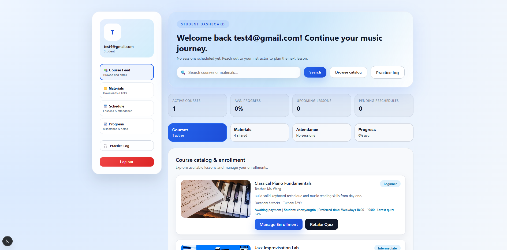
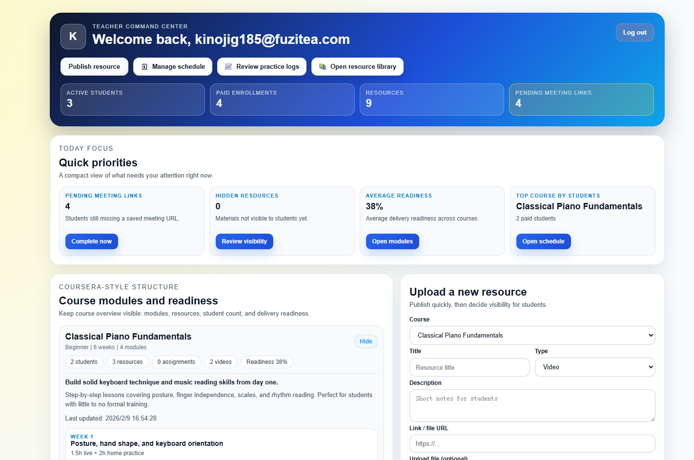

# Piano Learning Management System (Frontend)

A frontend web application for managing piano learning activities, built with **Next.js** and **Firebase**.  
The system is designed for **Students** and **Teachers**, providing role-based functionalities to support learning, teaching, and course management.

---

## Tech Stack
- Next.js
- React
- Firebase (Authentication, Firestore)
- JavaScript
- Stripe (Online Payment)

---

## Features

### Student Module
- Student authentication and access to a personalized dashboard
- View enrolled courses, learning progress percentage, materials, and attendance records
- Browse available courses and view detailed course information
- Upload practice logs (video or message) for teacher review and feedback
- Book lesson sessions by selecting available time slots

### Teacher Module
- Teacher authentication with a dedicated teacher dashboard
- Review student practice logs and provide feedback
- Manage lesson booking requests by approving or rejecting them
- Upload and manage teaching materials for students

### System Features
- Role-based access control (Student / Teacher)
- Real-time data updates using Firebase Firestore
- Online payment integration for course enrollment

---
## Live Demo

The application is deployed on Vercel and available at:

🔗 https://piano-learning-system-frontend-zfe2.vercel.app

Payment is integrated using Stripe Checkout in **test mode**. No real payment is required.

## System Demo Flow

This system supports two main user roles: **Student** and **Teacher**.

### Student Flow
1. Students log in using their email and password.
2. After login, students are redirected to the student dashboard.
3. The dashboard displays enrolled courses, learning progress, materials, and attendance records.
4. Students can browse available courses and view course details.
5. Students can upload practice logs (such as videos or messages) for teacher feedback.
6. Students can book lesson sessions by selecting available time slots.

### Teacher Flow
1. Teachers log in and access a dedicated teacher dashboard.
2. Teachers can review student practice logs and provide feedback.
3. Teachers can manage lesson booking requests by approving or rejecting them.
4. Teachers can upload teaching materials for students to study.

---

## Screenshots

### Student Home Page


### Teacher Home Page



---

## How to Run Locally

```bash
npm install
npm run dev